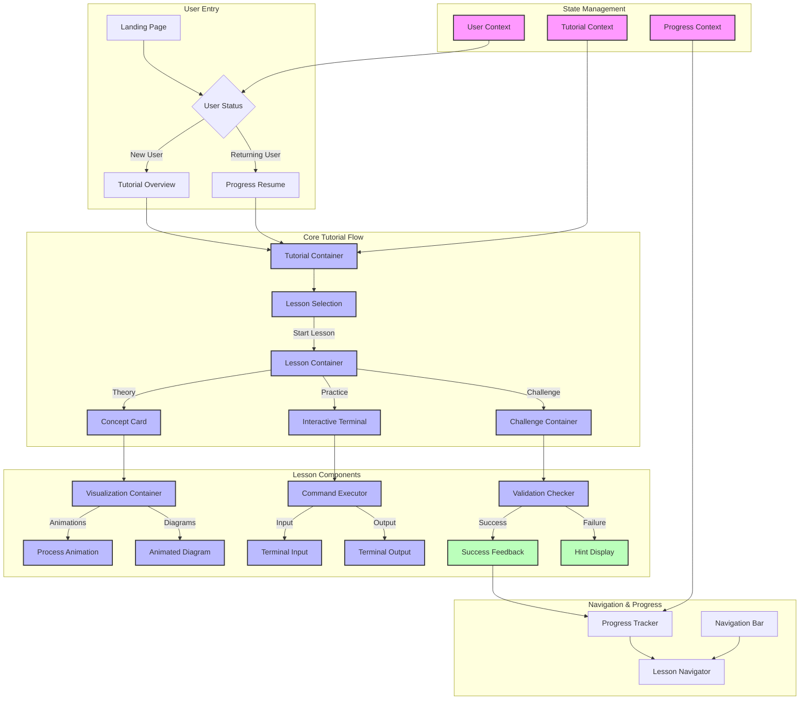

```mermaid
flowchart TD
    subgraph UserEntry ["User Entry"]
        A[Landing Page] --> B{User Status}
        B -->|New User| C[Tutorial Overview]
        B -->|Returning User| D[Progress Resume]
    end

    subgraph CoreFlow ["Core Tutorial Flow"]
        C --> E[Tutorial Container]
        D --> E
        E --> F[Lesson Selection]
        
        F -->|Start Lesson| G[Lesson Container]
        
        G -->|Theory| H[Concept Card]
        G -->|Practice| I[Interactive Terminal]
        G -->|Challenge| J[Challenge Container]
    end

    subgraph LessonComponents ["Lesson Components"]
        H --> K[Visualization Container]
        I --> L[Command Executor]
        J --> M[Validation Checker]
        
        K -->|Animations| N[Process Animation]
        K -->|Diagrams| O[Animated Diagram]
        
        L -->|Input| P[Terminal Input]
        L -->|Output| Q[Terminal Output]
        
        M -->|Success| R[Success Feedback]
        M -->|Failure| S[Hint Display]
    end

    subgraph Navigation ["Navigation & Progress"]
        T[Progress Tracker]
        U[Navigation Bar]
        V[Lesson Navigator]
        
        R --> T
        T --> V
        U --> V
    end

    subgraph StateManagement ["State Management"]
        W[Tutorial Context]
        X[Progress Context]
        Y[User Context]
        
        W --> E
        X --> T
        Y --> B
    end

    %% Styling
    classDef contextStyle fill:#f9f,stroke:#333,stroke-width:2px
    classDef componentStyle fill:#bbf,stroke:#333,stroke-width:2px
    classDef actionStyle fill:#bfb,stroke:#333,stroke-width:2px
    
    class W,X,Y contextStyle
    class E,F,G,H,I,J,K,L,M,N,O,P,Q componentStyle
    class R,S actionStyle
```